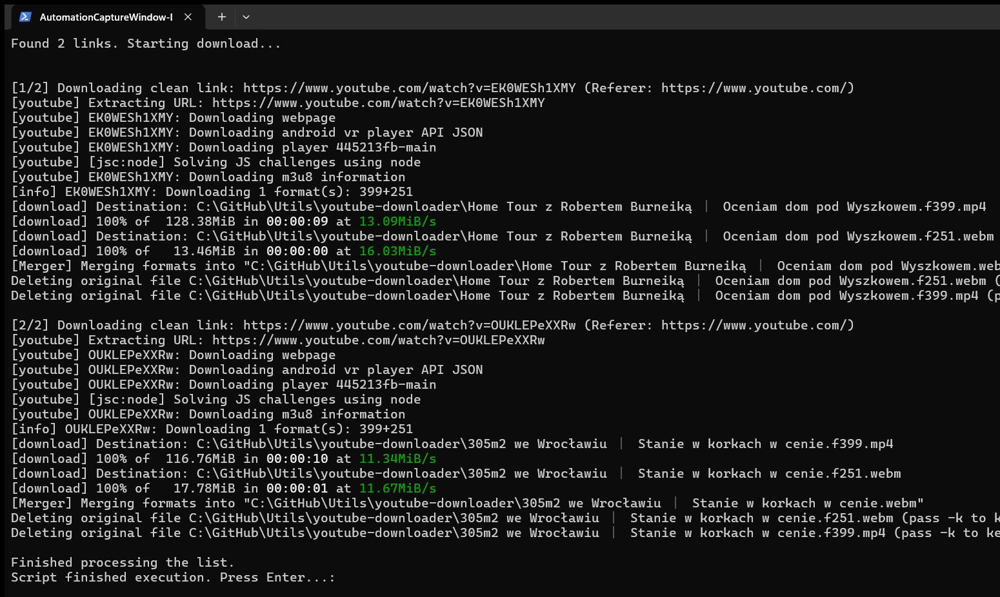
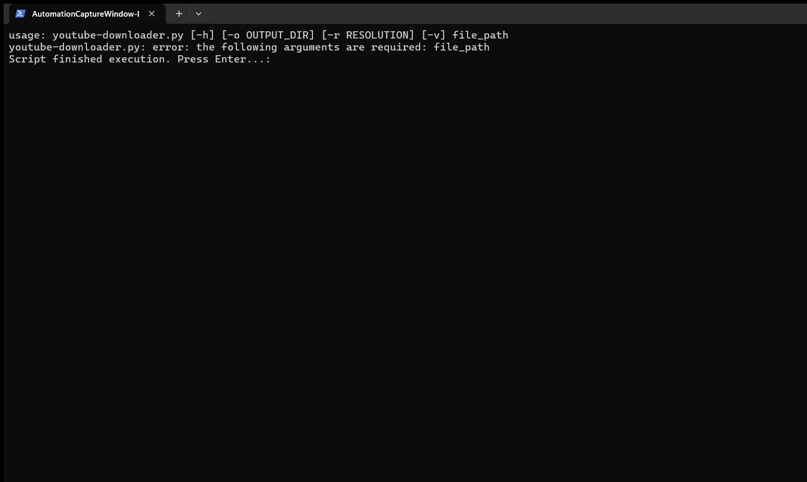

# YouTube Downloader

!Version

A robust, professional Python script to batch download videos from YouTube (and other platforms supported by `yt-dlp`). 

The script automatically processes lists of URLs, trims unnecessary URL parameters, sets dynamic referers for each domain, and automatically handles the installation of required libraries and JS runtime challenges (e.g., HTTP 403 Forbidden errors).

## Prerequisites

- **Python 3.8+**
- `yt-dlp` library (The script will attempt to install it automatically on the first run).
- **Node.js** or **Deno** (Required to bypass YouTube's recent anti-bot mechanisms. The script will warn you if it is missing).

## Author Information

- **Author**: Roman Pindela
- **Email**: roman.pindela@gmail.com
- **GitHub**: https://github.com/romanpindela

---

## Usage

Create a standard text file containing the video links you want to download (one link per line). Then, run the script via PowerShell or Command Prompt.

### Basic Example
Downloads videos up to 1080p to the current directory:
```bash
python youtube-downloader.py link_list.txt
```

## Authentication (For Private & Age-Restricted Videos)

If you want to download age-restricted, private, or premium videos that require you to be logged into your account, you need to provide your browser's cookies.

### How to get and set up `cookies.txt`:

1. **Install a browser extension** to extract cookies. For example, use **Get cookies.txt LOCALLY** for Google Chrome.
2. **Go to YouTube.com** (or the target website) and make sure you are logged in.
3. **Export the cookies** by clicking on the extension and downloading them in the Netscape format.
4. **Set up the directory**:
   - Navigate to the directory where this script (`youtube-downloader.py`) is located.
   - Create a new folder named `auth`.
   - Copy your downloaded file into this `auth` folder and rename it to `cookies.txt`.

The expected path should look like this:
`.../youtube-downloader/auth/cookies.txt`

Once this is done, the script will automatically pick up the cookies and authenticate your download requests.

*Note: Be careful with your `cookies.txt` file as it contains sensitive session data. Never commit it to a public GitHub repository.*

## Execution View

### Standard Run


### Help Output (-Help)

